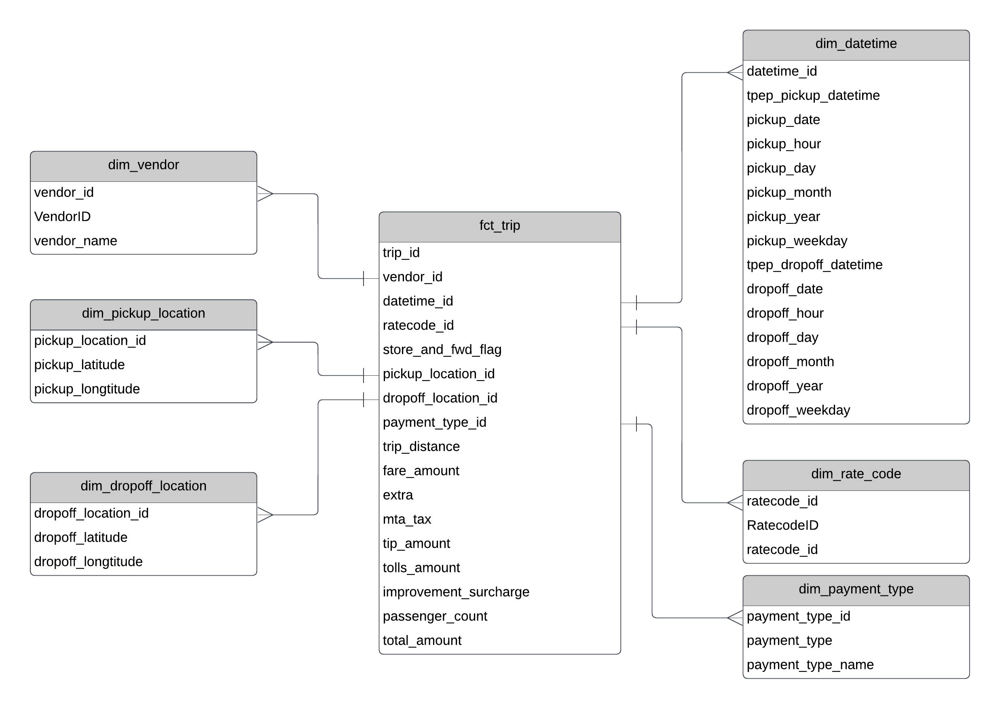

# NYC Yellow Cab Trips Data Engineering & Analytics | Eric Tran
## Introduction
Using Python Pandas, BigQuery, and Looker Studio to build an ETL pipeline, store processed data tables to cloud server, and create a dashboard for further analyses.
## Architecture Diagram

## Data Model

## Dashboard

## Technology Used
* Jupyter Notebook
* Python pandas & pandas-gbq
* Google Cloud Server
* BigQuery
* Looker

## Author
* Eric Tran
* erictq96@gmail.com or tranhu06@gmail.com
* https://www.linkedin.com/in/erictq96/
